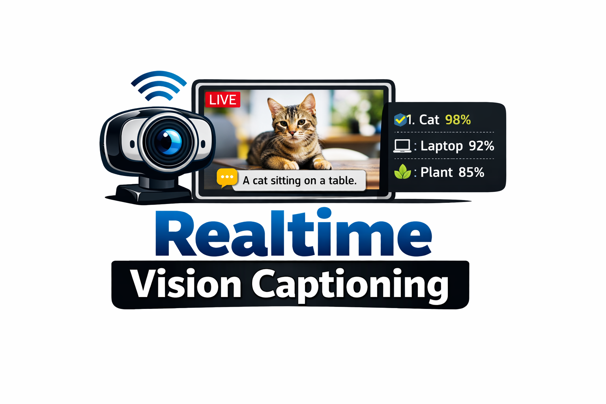
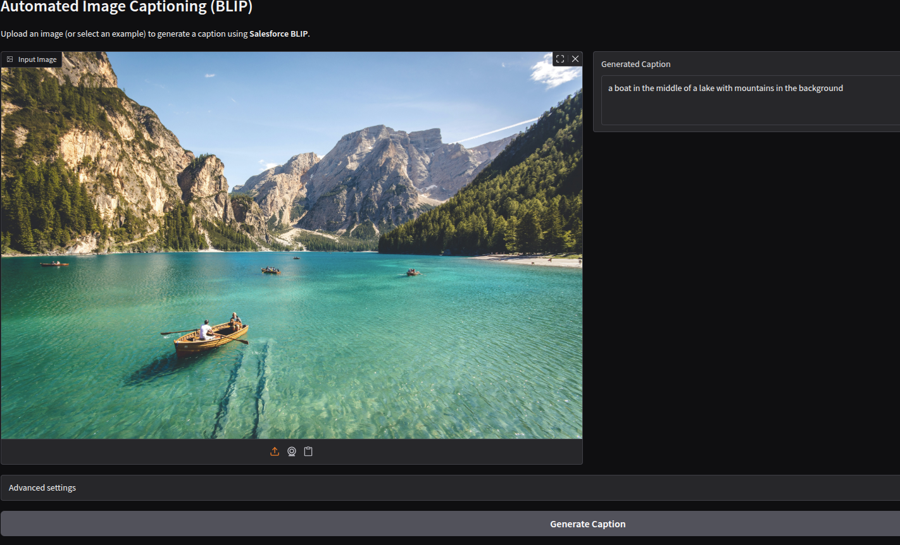
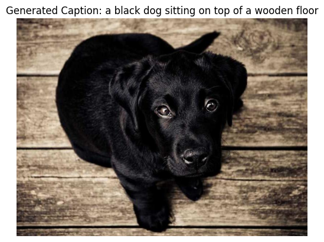
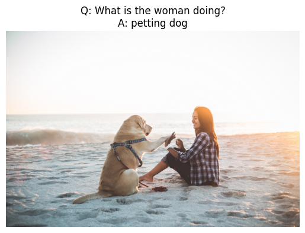

    
  <strong>🎥 Realtime Vision Captioning</strong> 
  Image Captioning · Visual Question Answering · Image Classification · Realtime Webcam

---

## Overview

This repository contains a curated set of **Jupyter notebooks** demonstrating core computer vision and vision–language capabilities using pretrained models. The notebooks progress from offline image understanding tasks to a **realtime webcam application** that performs image captioning and image classification on live video streams.

### Covered tasks
- Image captioning  
- Visual question answering (VQA)  
- Image classification  
- Realtime webcam captioning and classification  

---

## Why This Matters

Semantic understanding of visual data is a foundational capability for modern, user-facing AI systems. Tasks such as image captioning, visual question answering, and image classification allow machines to describe scenes, answer questions about visual content, and identify objects with high confidence.

These techniques power real-world applications including accessibility tools, interactive AI interfaces, and automated perception systems. This repository demonstrates how such models can be applied both in **offline experimentation** and **realtime interactive settings**.

---

## Tech Stack

- Python  
- PyTorch  
- Torchvision  
- Hugging Face Transformers (BLIP)  
- Gradio  
- PIL / NumPy  
- ImageNet pretrained models  

---

## Notebooks

### 1 — Image Captioning

**Notebook:** `01_image_captioning.ipynb`

This notebook implements image captioning using **BLIP** from **Hugging Face**, generating natural language descriptions from images.

- Supports local images and image URLs  
- Uses **Gradio** to provide an interactive, browser-based interface  

**Result**

  

  <em>Image captioning using Gradio</em>

  

  <em>Caption generated for a sample image</em>

---

### 2 — Visual Question Answering (VQA)

**Notebook:** `02_visual_question_answering.ipynb`

This notebook demonstrates visual question answering using **BLIP (VQA)**, enabling the model to answer natural language questions about image content.

- Accepts an image and a free-form question  
- Produces concise, human-readable answers  

**Result**

  

---

### 3 — Image Classification

**Notebook:** `03_image_classification_resnet50.ipynb`

This notebook performs image classification using a pretrained **ResNet-50** model trained on **ImageNet**.

- Outputs Top-K class predictions with confidence scores  
- Uses **Gradio** for interactive testing and visualization  

**Result**

  

  <em>Image classification using Gradio</em>

---

## ⭐ 4 — Main Notebook: Realtime Webcam Captioning & Classification

**Notebook:** `04_realtime_webcam_caption_and_classify.ipynb`

### Description

This notebook combines image captioning and image classification into a **realtime webcam application**, accessible directly through a web browser.

- **Input:** Live webcam frames  
- **Output:**  
  - A natural language caption describing the scene  
  - Top image classification predictions with confidence scores  

The outputs update continuously as the camera view changes, allowing real-time observation of model behavior.

### Design Highlights

- Captioning runs on the full frame to capture scene context  
- Classification operates on a center-focused crop to emphasize the primary object  
- Frame throttling balances responsiveness and performance  
- A **Gradio interface** provides adjustable controls:
  - Center zoom level  
  - Number of Top-K predictions  
  - Frame processing stride  
  - Enable captioning, classification, or both  

**Result**

  

---

## How to Run

Each notebook is fully self-contained.  
Open a notebook and run all cells in order.

For the realtime demo, webcam access is required.

---

## Notes

- All models are pretrained  
- No training or dataset setup is required  
- The notebooks are intended for experimentation and demonstration purposes  

---

## Contact

For questions or collaboration, please contact:

- amribrahim.amer@gmail.com

